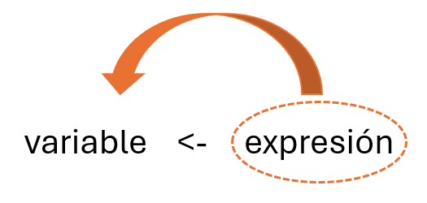
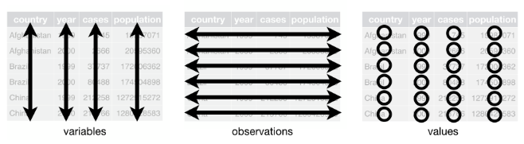

```{r setup, include=FALSE}
knitr::opts_chunk$set(echo = FALSE)
library(tidyverse)
```

# 1. Introducción al lenguaje R. Programación científica en R

# 1.1 Tipos de datos

## Tipos de objetos
Los objetos o variables de R pueden almacena:

- *valores numéricos*
- *valores alfabéticos* (cadenas de caracteres que van entre comillas dobles o comillas simples)
- *valores lógicos* (TRUE o FALSE)

```{r data-tupes, echo=TRUE}
# Variable numérica:
a = 2

# Variable alfabética (cadena de caracteres):
cadena = "Caracteres"

# Variable lógica:
## TRUE  ## verdadero, también abreviado como T
## FALSE  ## falso, también abreviado como F
1==TRUE  ## TRUE está mapeado al valor entero 1L
0==FALSE  ## FALSE está mapeado al valor entero 0L
```

## Tipos de objetos

Asignación de valores:

- Asignación: <-, =. 
- Cualquier variable solo puede tener un *único valor* en cada instante.
- Se evalua la expresión de la derecha

```{r imagen-asig, echo=FALSE, out.width = "60%"}
# Controlamos tamaño de la figura

```


## Tipos de objetos

```{r data-asign, echo=TRUE}
# Variable numérica:
x <- 3.2
y = 2*x - 5
y

y = 10.0
y

#Variable alfabética
nom = "Juan"
nom
```

## Tipos de objetos
```{r data-func, echo=TRUE}
# Lista de los objetos creados:
ls()

# Borrado de objetos:
rm(x)
ls()
```


## Operadores aritméticos

- Operadores aritméticos: +, -, *, / y ^.
    + funciones log, exp, sin, cos, tan y sqrt.

```{r operators, echo=TRUE}
var1 <- 1.2
var2 = 0.25
var3 = 3*sin(var2)+23.57
var3

z = 3
i = (z*2+75)/2
i
```

## Operadores lógicos

- Operadores lógicos: <, <=, >, >=, ==, y !=. 
- Siendo v1 y v2 variables lógicas
  + v1&v2: conjunción
  + v1|v2: disyunción
  + !v1: negación de V1

```{r operators2, echo=TRUE}
a <- 2>3
a
b <- 5<10
c <- a&b
c
```


# 1.2 Funciones

## Funciones: definición

- Tipo de objeto de R

  - Conjunto de líneas de código que definen una tarea

- Llevan a cabo una tarea concreta a partir de unos parámetros.

- Se pueden utilizar en cualquier punto del programa.

- Existen funciones que podemos utilizar: llamarla indicando su nombre y su lista de argumentos (entre paréntesis y separados por comas).

```{r funcion-max, echo=TRUE}
# Esta instrucción devuelve el máximo de todos los números que se le han pasado por argumento
max(4,5,6,12,-4)
# Media de una secuencia de 30 elementos elegidos al azar de entre el 1 y el 100.
mean(sample(1:100, 30))
```


## Funciones: creación

- Creación de funciones propias:
    + Cuerpo delimitado por {}
    + Instrucción por línea
    + Indicar valores por defecto de argumentos (en caso de tenerlos)
    
```{r function, echo=TRUE}
#Función que convierte un valor en km, decímetros, centímetros o milímetros a metros.
convUnitsToMeters = function(val, from="km"){
  #La función switch de R compara el contenido de una variable con  un conjunto de opciones. 
  mult = switch(from,km=1000,dm=0.1,cm=0.01,mm=0.001,NA)
  if (is.na(mult)) stop("Unknown target unit of lenght")
  else return (val*mult)
}
convUnitsToMeters(23,"km")
convUnitsToMeters(from = "cm", val = 40)
```

## Funciones: creación

Llamada a una función:

- Indicando el nombre de los parámetros. Ventaja: omitir el nombre de parámetros que tengan valor por defecto y no queramos modificar.
```{r funcion4, echo=TRUE}
convUnitsToMeters(from="km",val=56.2)
```

- Sin indicar el nombre de los parámetros. Es necesario respetar la posición. 
```{r funcion5, echo=TRUE}
convUnitsToMeters(56.2,"km")
```

- Mezcla de las anteriores
```{r funcion6, echo=TRUE}
convUnitsToMeters(56.2, from="km")
```

# 1.3 Vectores.

## Vectores: definición

- Objeto básico de R. 
- Estructura de datos **homogénea** en la que los valores almacenados ocupan una determinada posición.
- Creación de vector mediante operador ":"

```{r vectores, echo=TRUE}
1:20
10:15 - 1
```

## Vectores: creación

- Creación de vector mediante función c():

```{r vectores0-1, echo=TRUE}
v1 = c(10, 20, 30)  # elementos que va contener el vector
v1

v2 = c("jamón", "jabugo", "5J")
v2

# Tamaño del vector
length(v1)
```

## Vectores: creación

- Creación de vector mediante función c():

```{r vectores0-2, echo=TRUE}
# Homogeneo????
v = c(5, 2, 53.85, 43.2, 30, "abd")
#Todos los elementos del vector se han convertido a tipo string (lo comprobamos).
v
mode(v)
length(v)
```

## Vectores: creación

- Creación de vector mediante función `seq()`:
```{r vectores1-0, echo=TRUE}
x = seq(-3, 3, by=.5) #inicio, fin, salto
x
# Al especificar que solo queremos 4 elementos, calcula él el salto
seq(from = 1, to = 5, length = 4) 
# Ahora le especificamos el tamaño, el inicio y el salto, por lo que calcula automáticamente
# cual será el fin
seq(length = 10, from = -2, by = 0.2)
```


## Vectores: creación

- Creación de vector mediante repetición de secuencia o secuencias aleatorias:

```{r vectores1-1, echo=TRUE}
rep(5, 4)
rep(1:2, each = 3)

# Secuencias aleatorias:
rnorm(4, mean=10, sd=3)
```

## Vectores: creación

- Creación de vector vacío:

```{r vectores1-2, echo=TRUE}
x = vector()
x
```


## Vectores: indexación

- Acceso a determinados elementos de un vector
- `NA`: dato faltante. Las operaciones no se pueden realizar, pero no da error.
```{r indexacion, echo=TRUE}
vl = c(FALSE, TRUE, NA, TRUE, TRUE)
vl
# Elemento que se encuentra en la 5º posición
vl[1:3]
# OJO: en R, el acceder a una posición que NO existe no genera ningún error
vl[7]
```

## Vectores: indexación

- Indexación mediante **máscara**.
```{r indexacion2, echo=TRUE}
x = c(0, -3, 4, -1, 45, 90, -5)
x[x>0]
x[x<=-2 | x>5]
x[x>40 & x<100]
```


## Vectores: modificación del tamaño

```{r vectores3, echo=TRUE}
# x es un vector con elementos de -3.0 a 3.0 con salto de 0.5
x = seq(-3, 3, by=.5)
x
length(x)
# Añadimos el elemento 28 en la posición 15:
x[15] = 28
# Como en la posición 14 no tenía nada, se ha añadido un NA, hasta llegar a la nueva posición
x
```

## Vectores: operaciones vectorizadas

- Las operaciones sobre vectores se realizan elemento a elemento.
```{r vectores4, echo=TRUE}
v1 = c(1, 3, 5)
v2 = c(18, 9, 28)
v1+v2

# OJO: el tamaño no coincide
v1 = c(1, 3, 5, 7)
# Es como si v2 fuera (10, 2, 10, 2)
v2 = c(10, 2)
v1 + v2
```

## Vectores: operaciones vectorizadas

```{r vectores5, echo=TRUE}
# Si el tamaño no es un múltiplo, sale un warning
v2 = c(10, 2, 4)
v1 + v2
```

# 1.4 Factores.

## Factores: definición

- Manejo de valores categóricos.

```{r data-factors, echo=TRUE}
cats = c(rep("malo", 2), rep("regular", 2),
         rep("bueno", 3) )
fcats = factor(cats)
fcats
as.numeric(fcats)  ## Código numérico para cada categoría
levels(fcats)  ## Niveles de categorías reconocidos
```

## Factores

- Por defecto, R trata los factores como si fuesen variables *nominales*, no *ordinales*.

```{r data-factors-ord, echo=TRUE}
## Establecer explicitamente un orden de los niveles
ofcats = factor(cats, labels = c("malo", "regular", "bueno"),
                ordered = TRUE)
ofcats
```

## Factores

- Con una variable de tipo factor se pueden contar las ocurrencias de cada posible valor.

```{r data-factors-op, echo=TRUE}
fgenero = factor(c("m", "f", "m", "m", "m"), levels = c("f","m"))
table(fgenero)

a = factor(c("adult", "adult", "juvenil", "juvenil", "adult"))
# Se pueden cruzar dos factores
t = table(a,fgenero)
t
```

## Factores

- Función **gl()**: generación de factores a partir de secuencias. 

```{r secuencias4, echo=TRUE}
# gl(número de niveles, número de repeticiones)
gl(3, 5)
gl(2, 5, labels = c("female", "male"))
```


# 1.5 Matrices y Arrays

## Matrices: definición y creación

- **Array**: vector de varias dimensiones.

  - **Matriz**: array de 2 dimensiones

- Estructura **homogénea** de almacenamiento.

```{r matrices1, echo=TRUE}
# Vector
m = c(45, 23, 66, 77, 33, 44, 56, 12, 78, 23)
m
# El contenido del vector se reparte a través de la matriz con 2 filas y 5 columnas.
dim(m) = c(2, 5)
m
```

## Matrices: creación

- Construcción de una matriz mediante la función `matrix(contenido de la matriz en forma de vector, número de filas, número de columnas)`.

```{r matrices2, echo=TRUE}
# La matriz se va rellenando por columnas
m = matrix(c(45, 23, 66, 77, 33, 44, 56, 12, 78, 23), 2, 5)
m
# Si queremos que la matriz se vaya rellenando por filas, debemos utilizar el argumento byrow
m = matrix(c(45, 23, 66, 77, 33, 44, 56, 12, 78, 23), 2, 5, byrow = TRUE)
m
```

## Arrays: creación

- Creación de un array multidimensional mediante la función `array()`. 

- Hay que indicarle el contenido del array y la dimensión.

```{r array, echo=TRUE}
# Array de dimensión 4x3x2
a = array(5:29, dim=c(4, 3, 2))
a
```

## Matrices y Arrays: nombre de columnas y filas

- Función `colnames()`: darle nombre a las columnas de una matriz

- Función `rownames()`: darle nombre a las filas de una matriz.

```{r matrices3, echo=TRUE}
results = matrix(c(10, 20, 30, 40, 21, 32, 43, 13), 2, 4, byrow = TRUE)
colnames(results) = c("1qrt", "2qrt", "3qrt", "4qrt")
rownames(results) = c("store1", "store2")
results
```

## Matrices y Arrays: indexación

- Se puede acceder a los elementos de una matriz igual que se puede acceder a los elementos de un vector.

```{r indexacion-matrices, echo=TRUE}
m[1, ] # elementos de una fila
m[, 4] # elementos de una columna
m[1, -c(3, 5)] # elementos de una fila menos los que están en ciertas columnas
m[-2, 1]# Elemetos de una columna menos los que están en una determinada fila
```

## Matrices y Arrays: indexación

- La indexación en arrays es igual que en las matrices.

```{r indexacion-matrices2, echo=TRUE}
a[1, 3, 2]
a[1, , 2]
a[4, 3, ]
a[c(2, 3), , -2] # elementos de las filas 2 y 3, todas las columnas, solo los que están en la primera tabla
```

## Matrices y Arrays: indexación

- Se puede indexar por nombre.

```{r indexacion3, echo=TRUE}
results["store1", ]
results["store2", c("1qrt", "4qrt")]
```

## Matrices y Arrays: añadir

- Función `cbind()`: unir columnas a una matriz o array.

- Función `rbind()`: unir filas a una matriz o array.

```{r matrices4, echo=TRUE}
m1 = matrix(c(45, 23, 66, 77, 33, 44, 56, 12, 78, 23), 2, 5)
m1
# Añadimos el vector (4 ,76) en la 4º columna de m1
m2 = cbind(c(4, 76), m1[, 4])
m2
```

## Matrices y Arrays: unión

```{r matrices5, echo=TRUE}
# Definimos una nueva matriz
m3 = matrix(rep(12, 20), 4, 5)
m3
# Creamos una matriz a partir de la unión de la fila 1 de m1 y la fila 3 de m3
m4 = rbind(m1[1, ], m3[3, ])
m4
```

## Matrices y Arrays: operaciones artiméticas

- Al igual que en los vectores, estas operaciones están vectorizadas.

```{r matrices6, echo=TRUE}
m1 = matrix(c(45, 23, 66, 77, 33, 44), 2, 3)
m1
m2 = matrix(c(12, 65, 32, 7, 4, 78), 2, 3)
m2
m1 + m2
```

## Matrices y Arrays: operaciones aritméticas

```{r matrices7, echo=TRUE}
m1 - m2
2*m1
```


# 1.6 Listas

## Listas: definición y construcción

- Colección **heterogénea** y **ordenada** de elementos:

  - Permiten crear **agrupaciones de elementos de distinto tipo**.
  - Cada elemento de una lista puede ser un tipo de dato individual: un vector, una matriz, etc.

```{r list-index, echo=TRUE}
l1 = list(primero=c(1,2,3,4),
          segundo="hola",
          tercero=matrix(c(1,2,3,4), nrow = 2))
l1
```

## Listas: definición y construcción

Dar nombre a los elementos después de crear la lista.

```{r lista2, echo=TRUE}
my.lst2 = list(12584, "Marcos", c(8.5, 10, 17,9.75))
names(my.lst2) = c("id", "name", "marks")
my.lst2
```

## Listas: definición y construcción

- Función **unlist()**: transforma una lista en un vector -> cambios en los tipos de elementos (cadenas de caracteres).

```{r lista3, echo=TRUE}
unlist(my.lst2)
```

## Listas: indexación

Mediante el nombre de los elementos o mediante la posición que ocupan.

```{r lists-ii, echo=TRUE}
l1$primero # equivalente a: l1[[1]]
l1$primero[1]
# Elemento que se encuentra en la 3º posición
l1[[3]] # Si no ponemos corchetes, obtenemos una sublista de la lista original

## ¿Cómo obtenemos el elemento [2,2] de la matriz en tercer lugar de la lista?
l1[[3]][2,2]
l1$tercer[2,2]
```

## Listas: modificación

Añadir o quitar elementos a una lista.

```{r listas-iii, echo=TRUE}
# Añadimos un elemento
l1$cuarto = c("Ana", "Miguel", "Juan")
l1
```

## Listas: modificación

```{r listas-iv, echo=TRUE}
# Quitamos un elemento
l1 <- l1[-2]
l1
```

La importancia de las listas radica en que muchos de los tipos complejos de R se derivan de listas.


# 1.7 Data Frames: datos estructurados en R

## Datos estructurados y no estructurados

- Los **datos estructurados** son aquellos que podemos organizar aplicando
un esquema previo (estructura), que es conocido antes de realizar su análisis
y se mantiene fijo.
    + Ejemplo: una tabla de una base de datos relacional, un archivo CSV.
- Los **datos no estructurados** son aquellos que no podemos organizar a
priori, puesto que pueden contener cualquier tipo de información en cualquier
formato. 
    + Ejemplo: transcripciones de conversaciones sobre las que aplicamos PLN.

- En el lenguaje R, se creo un tipo o estructura de datos que permite almacenar
datos estructurados, semejante a una tabla en una base de datos.
- Esperamos tener las variables por columnas y los casos (sujetos, elementos) en
cada una de las filas.
- Este tipo de datos se denominó `data.frame` (marco o tabla de datos).
- Esta idea ha calado tan hondo en la ciencia de datos que **se ha replicado exactamente**
en otros lenguajes y entornos.
    + En Python (librería `Pandas`) o en Spark (`DataFrames` y derivados).
    
## Data Frames: creación

```{r data-frames-fromlist, echo=TRUE}
## A partir de una lista
lista2 = list(A=c(1,2,3,4),
              B=c(0.1, 0.2, 0.1, 0.2),
              Group=c("M", "M", "F", "F"))
df1 = as.data.frame(lista2)
df1
```

## Data Frames: características

```{r data-frames-caract, echo=TRUE}
# Número de filas
nrow(df1)
# Número de columnas
ncol(df1)
# Dimensión
dim(df1)
```

## Data Frames: características

```{r data-frames-caract2, echo=TRUE}
names(df1)
# Podemos cambiar el nombre de las columnas de un Data Frame
names(df1)=c("col1","col2","col3")
df1
```

## Data Frames: inspección de contenido

```{r data-frames-inspection, echo=TRUE}
## CO2 es uno de los numerosos Data Frame precargados en R
## ?CO2
head(CO2)  ## Muestra las 6 primeras filas
tail(CO2)  ## Muestra las 6 últimas filas
```

## Data Frames: indexación

- Igual que la indexación de matrices: por posición o por nombre

```{r data-frames-index, echo=TRUE}
## Nominal (mediante nombre)
df1$col3
## Índice numérico (como una lista)
df1[[2]]
```

## Data Frames: indexación

También se pueden utilizar **máscaras**.

```{r data-frames-indexcond, echo=TRUE}
## Imponemos condición booleana en indexación
## ¡Cuidado, la coma al final es importante!
## Con esa coma seleccionamos todas las columnas
df1[df1$B < 0.2,]  

## Una columna en concreto
df1[df1$B < 0.2, 3]
```

## Data Frames: añadir columnas

```{r data-frame-addcolum, echo=TRUE}
df1$Nota = c(4.5, 5.6, 6.1, 6.7)
df1
```

## Data Frames: agrupando valores

```{r grouping, echo=TRUE}
lista2 = list(A=c(1,2,3,4), 
              B=c(0.1, 0.2, 0.1, 0.2), 
              Group=c("M", "M", "F", "F"))
df1 = as.data.frame(lista2)
df1
```

## Data Frames: agrupando valores

```{r grouping2, echo=TRUE}
grupos = split(df1, df1$Group)
class(grupos)
grupos
```

# 1.8 Fechas

## Fechas

- Paquete `lubridate` -> `library(tidyverse)`
- Objetos:
  + Dia `<date>`
  + Tiempo `<time>`
  + Dia-tiempo `<dttm>`

- **ISO8601**: año-mes-día horas:minutos:segundos

```{r time, echo=TRUE}
today()
now()
```


# 1.9 Importación y exportación de datos

## Importar datos

Importación de datos desde fuentes externas:

- Función `read.table()`. Contenido del fichero:
  + 1º fila = nombres de las variables.
  + cada fila = etiqueta fila + valores variables.


```{r read_table, echo=TRUE}
data_economist <- read.table(file = "data/EconomistData.csv",
                    header = TRUE,
                    sep = ",")
head(data_economist)
```

## Importar datos

- Otras funciones: `readxl::read_excel()` 

```{r read_excel, echo=TRUE}
data_rrhh <- readxl::read_excel("data/RRHH.xlsx")
data_rrhh
```

## Importar datos

- Otras funciones: `read.csv()`

```{r read_csv, echo=TRUE}
data_students <- read.csv("data/students.csv")
data_students
```

## Exportar datos

- Función `write.table()`
- Función `openxlsx::write.xlsx()`: exportar en excel
- Función `write.csv()`: exportar texto

```{r export, echo=TRUE}
openxlsx::write.xlsx(x = lista2, 
                     file = "data/lista2_excel.xlsx")
write.csv(x = lista2, file = "data/lista2_csv.csv")
```


# 1.10 Tidy data

## Principio de tidy Data

- Creador: **Hadley Wickham**, 2014
  + Establece los fundamentos de tidy data (estandar para el trabajo con datos estructurados en R).
  + Paquetes: ggplot2, dplyr y tidyr, devtools...
- **Tidyverse**: conjunto de paquetes de R que giran en torno a la premisa tidy data.
  + `dplyr`: procesado de datos estructurados de forma organizada y con fuen rendimiento.
  + `magrittr`: operador pipe (%>%)
  + `tidyr`: paquete principal que implementa los fundamentos de tidy data.


## Principios de tidy data: reglas básicas

**Principios básicos** para ajustarnos a las normas de **tidy data** son [@WickhamJSS2014]:

1. Cada **variable** está en **una columna**.
2. Cada **observación** está en **una fila**.
3. Cada **valor** está en **una celda**.

(Basado en la filosofía de la tercera forma normal en bases de datos (Codd, 1990))

```{r imagen, echo=FALSE, out.width = "80%"}
# Controlamos tamaño de la figura

```

*Messy data*: los que no se ajustan.

## Principios de tidy data: reglas básicas

Table: Ejemplo de un conjunto de datos típico.

|  name   |   treatment_a  |  treatment_b  |
|:--------| --------------:|--------------:|
| John Smith | --- | 2 |
| Jane Doe   | 16 | 11 |
| Mary Johnson | 3 | 1 |


Table: En formato *tidy data*.

| name   |  treatment  | result  |
|:-----------|:-------------|----------:|
| John Smith | a | --- |
| Jane Doe | a | 16 |
| Mary Johnson | a | 3 |
| John Smith | b | 2 |
| Jane Doe | b | 11 |
| Mary Johnson | b | 1 |

- Variables *categóricas* -> fila nueva por cada observación para cada nivel registrado de la variable
  + No hay pérdida de eficiencia: manejo interno mediante números enteros

## Principios de tidy data: ventajas

- Forma consistente de almacenar los datos -> uniformidad en las funciones. 

- Tener las variables en columnas favorece la capacidad de vectorización de R.

- `dplyr`, `ggplot2` y todos los paquetes de `tidyverse` están diseñados para trabajar con tidy data.


## Principios de tidy data: ordenar datos

- Funciones para pivotar datos: `pivot_longer()` y `pivot_wider()`.

```{r tidy-data, echo=TRUE}
df <- tribble(
  ~name,  ~treatment_a, ~treatment_b,
   "Johm Smith", NA ,  2,
   "Jane Doe",  16,  11,
   "Mary Johnson",  3,  1
)
df
```

## Principios de tidy data: ordenar datos

```{r tidy-data2, echo=TRUE}
# Los NA en realidad no son valores faltantes
df |> 
  pivot_longer(
    cols = starts_with("treatment"), 
    names_to = "treatment", 
    values_to = "result"
  )
```

## Principios de tidy data: unión

- `left_join()`: all rows from x
- `right_join()`: all rows from y
- `full_join()`: all rows from both x and y
- `semi_join()`: all rows from x where there are matching values in y, keeping just columns from x
- `inner_join()`: all rows from x where there are matching values in y, return all combination of multiple matches in the case of multiple matches
- `anti_join()`: return all rows from x where there are not matching values in y, never duplicate rows of x

## Principios de tidy data: unión

```{r joins, echo=TRUE}
x <- tibble(
    id = c(1, 2, 3),
    value_x = c("x1", "x2", "x3"))
x = as.data.frame(x)
x
y <- tibble(
    id = c(1, 2, 4),
    value_y = c("y1", "y2", "y4"))
y = as.data.frame(y)
y
```

## Principios de tidy data: unión

```{r joins2, echo=TRUE}
z1 <- x |> left_join(y,
                    by = "id")
z1
z2 <- x |> right_join(y,
                      by = "id")
z2
```

## Principios de tidy data: unión

```{r joins3, echo=TRUE}
z3 <- x |> full_join(y,
                     by = "id")
z3
```
